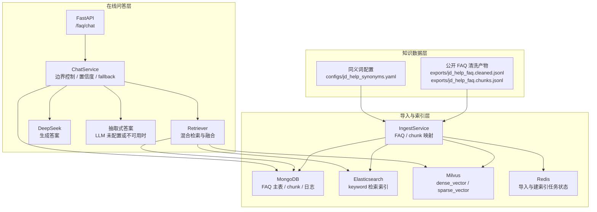
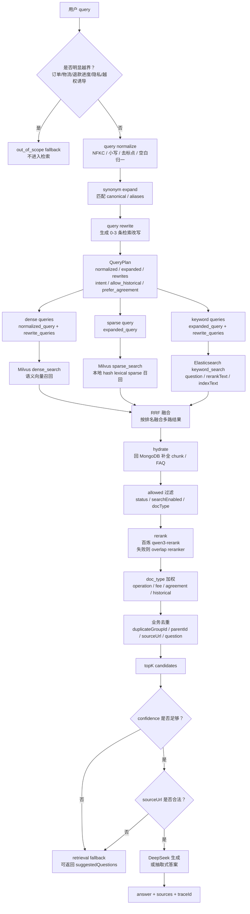

# 02-项目架构

本文从系统全局到检索细节，梳理 `canbe_agents` 当前的 FAQ RAG 后端架构。项目的核心不是“接一个大模型接口”，而是把公开 FAQ 问答做成一条可控、可追踪、可兜底的检索增强生成链路。

## 1. 总体架构图



这一层可以用“图书馆”类比：MongoDB 像总书库，保存 FAQ 与 chunk 的完整档案；Elasticsearch 像关键词目录，适合查明确词面；Milvus 像语义索引，适合查相近含义；Redis 只记录任务进度，不承担知识事实本身。

## 2. 检索链路图



这条链路的设计重点是“先收敛，再生成”。检索层先把问题压成结构化的 `QueryPlan`，再用多路召回扩大候选面，最后通过重排、过滤、置信度和来源校验决定是否回答。

## 3. Query Normalize

`query normalize` 是把用户口语化、符号混乱的输入变成更稳定的检索输入。当前实现位于 `app/retrieval.py` 的 `normalize_query`。

主要规则：

- 使用 Unicode NFKC 做全角/半角归一。
- ASCII 字母数字转小写并保留。
- 中文字符和非 ASCII 字母数字保留。
- 标点、特殊符号统一替换为空格。
- 多个空白合并为一个空格，并去掉首尾空白。

例如：

```text
Raw:  企业微信，能不能走网银？？
Normalized: 企业微信 能不能走网银
```

其意义类似“把不同口音先转成普通话”。normalize 不负责理解业务，它只降低表面表达差异，让后续 synonym 和 rewrite 更容易命中。

数学上可以把它看作一个确定性映射：

$$
q_n = f_{norm}(q)
$$

其中 $q$ 是原始问题，$q_n$ 是规范化后的问题。

## 4. Synonym

`synonym` 负责把用户的简称、别称、口语词映射到业务标准词。当前配置在 `configs/jd_help_synonyms.yaml`，读取逻辑在 `QueryProcessor.terms_for_text`。

当前词典示例：

| canonical | aliases |
| --- | --- |
| 支付 | 付款、付钱、结算、收银台、网银、网银支付 |
| 企业微信 | 企微、企业微信端 |
| 发票 | 开票、票据、数电票、电子发票 |
| 价格保护 | 价保、补差价、买贵了 |
| 运费 | 邮费、配送费、续重费、逆向运费 |

如果用户问“企微能不能走网银”，系统会识别出：

```text
canonicalTerms: 企业微信, 支付
synonymTerms: 企微, 企业微信端, 付款, 付钱, 结算, 收银台, 网银, 网银支付
```

然后形成 `expanded_query`：

```text
normalized_query + canonical_terms + synonym_terms
```

这一步的价值在于补齐“用户词”和“文档词”的差异。dense 向量能处理一部分语义相似，但对业务简称、专有名词、错位表达并不总是可靠；显式 synonym 是低成本且可控的召回增强。

## 5. Rewrite

`rewrite` 是在 synonym 的基础上，生成更适合检索的 0-3 条改写问题。当前实现是规则型，不调用 LLM，位于 `rewrite_query`。

示例规则：

- 当识别到“企业微信/企微”并且问题里含“网银”时，补充：
  - `企业微信是否支持网银支付`
  - `京东企业购企业微信端支持哪些支付方式`
- 当识别到“邮费”时，改写为“运费”。
- 当识别到“买贵了/补差价”时，改写为“价格保护”。
- 当识别到“开票”时，改写为“发票”。

rewrite 的边界很重要：它只改写检索表达，不生成答案，也不引入知识库之外的业务承诺。可以把它理解为“给检索员多写几张检索卡片”，而不是“替客服编结论”。

当前限制：

- 最多 3 条改写。
- 每条最多 60 字。
- 与 normalized query 相同的改写会被去掉。

## 6. Dense / Sparse / Keyword

系统同时使用三类召回信号，原因是每种信号擅长的问题不同。

### 6.1 Dense

`dense` 使用 embedding 模型把文本编码为稠密向量，并在 Milvus 中做向量相似度检索。当前调用百炼 / DashScope 兼容 embeddings API，默认模型为 `text-embedding-v4`。

在线检索时：

```text
dense_queries = normalized_query + rewrite_queries
```

每条 dense query 都会向量化，并调用：

```text
Milvus.dense_search(...)
```

dense 的优势是语义泛化。例如“密码丢了”和“忘记密码”词面不同，但语义接近。它的弱点是对精确编号、专有名词、业务黑话、否定条件可能不够敏感。

### 6.2 Sparse

`sparse` 当前不是外部稀疏模型，而是本地 `hash lexical` 表示：把文本中的词和中文单字 hash 到固定维度，形成稀疏向量，再写入 Milvus 的 `SPARSE_FLOAT_VECTOR` 字段。

在线检索时：

```text
sparse_query = expanded_query
```

然后调用：

```text
Milvus.sparse_search(...)
```

sparse 更像“可计算的词面匹配”。它不如 dense 会联想，但对明确词项更敏感，尤其适合“网银”“发票”“E卡”“运费”这类业务词。

### 6.3 Keyword

`keyword` 使用 Elasticsearch 对 `question`、`rerankText`、`indexText` 做多字段匹配。当前检索入口是：

```text
ElasticSearch.keyword_search(...)
```

在线检索时：

```text
keyword_queries = expanded_query + rewrite_queries
```

keyword 的作用类似传统搜索引擎：当用户输入中含有关键业务词时，它能快速拉出词面高度相关的 chunk。代码里还会根据 `allow_historical` 和 `prefer_agreement` 调整过滤或加权逻辑。

三路召回的互补关系如下：

| 召回方式 | 更擅长 | 主要风险 |
| --- | --- | --- |
| dense | 语义相近、问法变化 | 可能忽略精确词和业务边界 |
| sparse | 词项、简称、业务关键词 | 语义泛化弱 |
| keyword | 明确词面匹配、多字段检索 | 依赖索引文本质量 |

## 7. RRF

RRF，全称 Reciprocal Rank Fusion，即倒数排名融合。它解决的是“不同召回器分数不可比”的问题。

在本项目里，dense、sparse、keyword 的原始分数来源不同：

- dense 是向量相似度。
- sparse 是稀疏向量内积。
- keyword 是 Elasticsearch 的文本相关性分数。

这些分数不能直接相加。RRF 不看原始分数绝对值，而看候选在每路结果中的排名：

$$
score(d)=\sum_i \frac{1}{k + rank_i(d)}
$$

其中：

- $d$ 是某个候选 chunk。
- $i$ 是第 $i$ 路召回结果。
- $rank_i(d)$ 是候选在第 $i$ 路中的排名。
- $k$ 是平滑参数，当前配置默认 `retrieval_rrf_k = 60`。

直观理解：一个候选如果在 dense、sparse、keyword 中都靠前，它比只在某一路偶然靠前的候选更可信。

当前实现细节：

- 以 `chunkId` 聚合多路结果。
- 记录候选来自哪些召回源，如 `dense+sparse+keyword`。
- 保存各路最高原始分数，但融合排序主要使用 `rrf_score`。
- RRF 后只保留一批 rerank 候选，数量为 `max(final_top_k * retrieval_rerank_candidate_multiplier, 20)`。

## 8. Rerank

RRF 之后的候选仍然只是“可能相关”。`rerank` 的任务是拿用户 query 和候选文本做更精细的相关性判断。

当前实现位于 `Reranker`：

1. 优先调用百炼 rerank API，默认模型 `qwen3-rerank`。
2. 输入为：
   - `query`: normalized query
   - `documents`: 每个候选的 `rerankText` / `indexText` / `chunkText`
3. 返回每个候选的 `rerank_score`。
4. 如果 rerank 服务不可用，降级为本地 `overlap_score`。

Rerank 后还会进入 `doc_type` 加权：

```text
ranking_score = rerank_score * doc_type_weight
```

默认权重包括：

| docType | 默认权重 | 作用 |
| --- | ---: | --- |
| operation_guide | 1.15 | 操作流程类内容略微前置 |
| fee_standard | 1.15 | 费用规则类内容略微前置 |
| faq | 1.00 | 普通 FAQ |
| policy_rule | 1.00 | 普通规则 |
| service_intro | 0.90 | 服务介绍略降权 |
| agreement | 0.65 | 协议默认降权，用户明确问协议时再提升 |
| historical_rule | 0.00 | 历史规则默认不参与普通问答 |
| compound_qa | 0.00 | 复合父文档不作为普通答案 |

这里要区分两个分数：

- `rerank_score` 更适合判断“是否命中”。
- `ranking_score` 更适合排序，因为它叠加了业务偏好。

如果把业务加权后的分数直接当置信度，可能会让“业务上应前置的文档”被误判为“语义上更确定”。当前代码没有这样做，置信度主要来自 rerank 分数或 RRF 分数。

## 9. Fallback

`fallback` 是这个系统的安全阀，不是失败提示。它表示系统认为“此时回答比不回答风险更高”。

当前有三类主要 fallback。

### 9.1 越界 fallback

入口在 `ChatService.chat` 的早期判断：

```text
is_out_of_scope(query)
```

命中以下类型时，直接返回 fallback，不进入检索：

- 订单状态：订单到哪、查订单。
- 物流状态：物流到哪、物流单号。
- 退款进度：退款多久到账、退款进度。
- 支付与账号隐私：支付记录、绑定手机号、身份证、银行卡。
- 越权诱导：忽略规则、绕过限制、随便编、不要看知识库。

返回文案明确说明：本助手仅基于京东帮助中心公开 FAQ，无法查询个人化信息。

### 9.2 低置信度 fallback

检索完成后，系统计算 top1 candidate 的置信度：

```text
confidence = candidate_confidence(candidates[0], query)
```

如果没有候选，或置信度低于 `retrieval_medium_confidence_threshold`，则返回：

```text
暂未找到与该问题高度相关的公开 FAQ。你可以换一种问法，或查看帮助中心分类。
```

此时系统可能仍然返回 `suggestedQuestionCandidates`，让前端展示“你是不是想问这些标准问题”。用户点击建议问题时，应传 `candidateId`，避免二次自由检索带来的波动。

### 9.3 来源非法 fallback

即使候选分数足够，系统还会校验来源：

```text
sourceUrl == https://help.jd.com/user/issue.html
或 sourceUrl.startswith(https://help.jd.com/user/issue/)
```

如果没有合法来源，系统不会把答案伪装成有依据的回答，而是 fallback。这是 RAG 系统和普通聊天机器人的关键差异：答案必须能落回可点击、可验证的公开来源。

## 10. 当前链路的工程边界

当前实现已经形成完整链路：

```text
query normalize
-> synonym
-> rewrite
-> dense / sparse / keyword
-> RRF
-> hydrate / allowed filter
-> rerank
-> doc_type weight
-> business dedup
-> confidence + source check
-> answer or fallback
```

但它仍不是生产终态，主要边界包括：

- synonym 仍是人工词表，覆盖范围取决于维护质量。
- rewrite 是规则型，稳定但覆盖有限。
- sparse 是本地 hash lexical 表示，不等价于完整 BM25 或神经稀疏模型。
- rerank 依赖外部 API，失败时只能降级到字符 overlap。
- 当前评测集规模较小，需要继续补充非标准问法、失败样本和长尾业务词。

如果用一句话概括当前架构：它是一个以公开 FAQ 为事实边界、以混合检索提升召回、以 RRF 和 rerank 稳定排序、以 fallback 控制风险的 RAG 后端。

## 11. 参考概念

- Milvus 官方文档：Hybrid Search / dense and sparse vectors，https://milvus.io/docs/hybrid_search_with_milvus.md
- Milvus 官方文档：Multi-Vector Hybrid Search / RRF Ranker，https://milvus.io/docs/multi-vector-search.md
- Elasticsearch 官方文档：Reciprocal Rank Fusion，https://www.elastic.co/guide/en/elasticsearch/reference/current/rrf.html
- OpenSearch 官方文档：Keyword search 默认使用 BM25，https://docs.opensearch.org/docs/latest/search-plugins/keyword-search/
