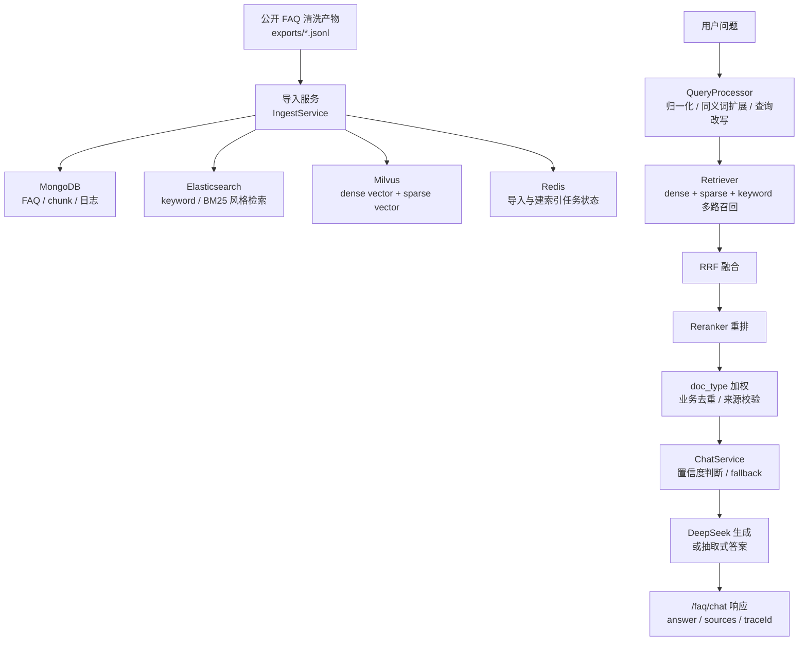

# canbe_agents

面向京东帮助中心公开 FAQ 的可控 RAG 后端与实验底座。当前仓库的产品中心已经从单点 `/faq/chat` 问答，转向以 `Experiment` 为中心的 RAG Lab：重点不是“让大模型什么都答”，而是把公开帮助文档加工成可检索、可追溯、可评测、可复跑的知识资产，并用实验流程判断一次改造到底是收益、持平还是退化。

## 项目背景

电商客服 FAQ 的难点通常不在“有没有答案”，而在用户不会按官方标题提问。例如官方文档写“忘记密码怎么办”，用户可能会问“密码丢了咋办”“登录密码忘了怎么处理”。同时，公开 FAQ 只能回答规则、流程、说明类问题，不能查询订单、物流、退款到账、支付记录、账号隐私等个性化状态。

本项目把问题建模为一个有边界的 RAG 系统：

$$
\max P(\text{grounded answer}\mid q,D)
$$

同时压低：

$$
P(\text{hallucination or overreach}\mid q,D)
$$

其中，$q$ 是用户问题，$D$ 是公开 FAQ 知识库。与普通聊天 Demo 相比，本项目更关注三件事：

- 公共知识可回答：规则、流程、费用、协议、操作指南等内容必须能被召回。
- 私有状态不越界：订单、物流、退款、支付、账号隐私等问题必须 fallback。
- 答案可追溯：正常答案必须带 `sourceUrl`，且来源限定在 `https://help.jd.com/user/issue.html` 或 `https://help.jd.com/user/issue/*.html`。

## 架构概览



核心模块：

- `app/main.py`：FastAPI 应用入口，初始化 MongoDB、Redis、Elasticsearch、Milvus、Embedder、Reranker、DeepSeek。
- `app/ingest.py`：把 `exports/jd_help_faq.cleaned.jsonl` 和 `exports/jd_help_faq.chunks.jsonl` 导入存储，并构建检索索引。
- `app/retrieval.py`：查询归一化、同义词扩展、查询改写、多路召回、RRF 融合、重排、业务去重。
- `app/chat.py`：问答边界控制、置信度判断、来源校验、fallback、反馈日志。
- `app/db.py`：MongoDB、Redis、Elasticsearch、Milvus 的访问封装。
- `app/api/*.py`：健康检查、问答、分类、热门问题、导入与建索引 API。

一个关键概念是 RRF（Reciprocal Rank Fusion，倒数排名融合）。不同召回器的原始分数尺度不可直接比较，RRF 使用排名位置融合候选：

$$
score(d)=\sum_i \frac{1}{k + rank_i(d)}
$$

直观类比：不是问“不同裁判给的分数谁更高”，而是看“同一个候选在多个裁判那里是否都排得靠前”。

## RAG Lab 产品中心

如果把旧版 `/faq/chat` 看作“面向单个问题的一次推理”，那么 RAG Lab 更像“面向一次改造的一整套实验台”。两者的关系可以类比为：

- `/faq/chat` 像显微镜：观察一条查询在当前链路下会得到什么答案。
- `RAG Lab` 像风洞实验：固定数据集、固定策略版本、固定评测集，重复跑、对比跑、定位哪里变好或变坏。

RAG Lab 的主闭环是：

```text
Dataset -> Pipeline -> Eval Set -> Experiment Run -> Comparison Verdict
```

其中：

- `Dataset` 解决“用什么知识快照做实验”。
- `Pipeline Version` 解决“用哪一套冻结配置跑实验”。
- `Eval Set` 解决“拿什么题来测，题目希望系统表现成什么样”。
- `Experiment Run` 解决“把一次配置真正跑完，并留下 case 级 trace 与 run 级 summary”。
- `Comparison Verdict` 解决“这次改造究竟是 `beneficial`、`neutral` 还是 `harmful`”。

一个容易忽略、但非常关键的对偶概念是：

- `/faq/chat` 关注的是单次响应正确不正确。
- `RAG Lab` 关注的是版本变化是否值得推进。

前者更像在线服务面，后者更像离线控制面。实验台不是聊天页的附庸，而是当前仓库更高优先级的产品中心。

## 技术栈

- Web 框架：FastAPI、Uvicorn
- 数据校验与配置：Pydantic v2、pydantic-settings、python-dotenv
- 异步 HTTP：httpx
- 主数据存储：MongoDB，异步驱动为 Motor
- 向量检索：Milvus / PyMilvus
- 关键词检索：Elasticsearch 7.x Python client
- 任务状态与缓存：Redis
- Embedding：阿里云百炼 / DashScope 兼容 embeddings API，默认 `text-embedding-v4`
- Rerank：阿里云百炼 / DashScope rerank API，默认 `qwen3-rerank`
- 生成模型：DeepSeek Chat API；未配置时降级为抽取式答案
- 测试：pytest、pytest-asyncio

## 核心能力

- 知识导入：从本地清洗后的 FAQ JSONL 产物导入 FAQ 主文档和 chunk 文档。
- 索引构建：写入 Elasticsearch 关键词索引，并写入 Milvus dense/sparse 向量索引。
- 查询增强：支持全半角归一化、标点清理、同义词扩展和少量规则化 query rewrite。
- 混合检索：dense、sparse、keyword 三路召回，再使用 RRF 融合。
- 重排与去重：调用 reranker 重排，并按 `duplicateGroupId`、`parentId`、`sourceUrl` 等业务键去重。
- 类型加权：对 `operation_guide`、`fee_standard`、`agreement`、`historical_rule` 等文档类型做差异化排序。
- 边界防护：对订单、物流、退款进度、支付记录、账号隐私、越权诱导等问题直接 fallback。
- 来源约束：正常回答必须来自允许的京东帮助中心 issue 链接。
- 可观测输出：响应包含 `traceId`、`confidence`、`sources` 和调试信息，便于定位召回和生成链路。
- 反馈闭环：`POST /faq/feedback` 记录用户反馈，后续可用于失败样本分析。

## 启动方式

### 1. 准备环境

```bash
python -m venv .venv
.venv\Scripts\activate
pip install -r requirements.txt
pip install -r requirements-dev.txt
```

如需重新清洗或导出 FAQ 原始数据，再安装离线清洗依赖：

```bash
pip install -r requirements-offline.txt
```

### 2. 配置 `.env`

复制示例配置：

```bash
copy .env.example .env
```

至少确认以下配置：

```env
MONGODB_URI=mongodb://localhost:27017
MONGODB_DATABASE=canbe_faq_rag

MILVUS_HOST=localhost
MILVUS_PORT=19530
MILVUS_COLLECTION=canbe_faq_rag_vector_index

ELASTICSEARCH_URL=http://localhost:9200
ELASTICSEARCH_INDEX=canbe_faq_rag_search_index

REDIS_URL=redis://localhost:6379/0
REDIS_PREFIX=canbe_faq_rag

BAILIAN_API_KEY=
DASHSCOPE_API_KEY=
DEEPSEEK_API_KEY=
DEEPSEEK_BASE_URL=https://api.deepseek.com
DEEPSEEK_MODEL=deepseek-chat
```

真实 API Key 只应放在本地 `.env` 或运行环境变量中，不应写入 README、测试用例或提交历史。

### 3. 启动 API

```bash
uvicorn app.main:app --reload --host 0.0.0.0 --port 8000
```

健康检查：

```bash
curl http://127.0.0.1:8000/health
```

RAG Lab 控制面期望暴露以下路由族：

- `GET /rag-lab/datasets`
- `POST /rag-lab/datasets`
- `POST /rag-lab/datasets/{dataset_id}/versions`
- `GET /rag-lab/pipelines`
- `GET /rag-lab/eval-sets`
- `GET /rag-lab/runs`
- `GET /rag-lab/comparisons`

说明：

- 这些接口是控制面，职责是编排 Dataset、Pipeline、Eval Set、Run、Comparison。
- 旧的 `/faq/chat` 仍可作为检索与回答链路的回归面，但不再代表产品主中心。

### 4. 导入知识与构建索引

项目默认读取：

- `exports/jd_help_faq.cleaned.jsonl`
- `exports/jd_help_faq.chunks.jsonl`

如果要把这批现有 FAQ 资产迁移为 RAG Lab 的 starter dataset / eval set manifest，可运行：

```bash
python scripts/bootstrap_rag_lab_from_existing_assets.py
```

默认会扫描 `exports/` 下现有的 `*.cleaned.jsonl` 与 `*.chunks.jsonl`，打印迁移摘要，并把 starter manifests 写到 `exports/rag_lab_bootstrap/`。

建议把迁移过程理解成两层：

- 第一层是“资产迁移”：把旧 FAQ 清洗产物整理成可版本化的 starter dataset / eval set 清单。
- 第二层是“实验迁移”：在 RAG Lab 中基于这些 starter manifests 创建 Dataset Version、补充 Eval Cases、冻结 Pipeline Version，再发起 Run 和 Comparison。

这种拆层的好处在于，知识资产和实验策略不再绑死。换句话说，`Dataset Version` 回答“世界是什么”，`Pipeline Version` 回答“系统怎么看这个世界”。

导入 FAQ 与 chunk：

```bash
curl -X POST http://127.0.0.1:8000/admin/ingest/import
```

构建 Elasticsearch / Milvus 索引：

```bash
curl -X POST http://127.0.0.1:8000/admin/ingest/build-index
```

查询异步任务：

```bash
curl http://127.0.0.1:8000/admin/ingest/tasks/{taskId}
```

问答示例：

```bash
curl -X POST http://127.0.0.1:8000/faq/chat ^
  -H "Content-Type: application/json" ^
  -d "{\"query\":\"忘记密码怎么办？\",\"sessionId\":\"demo\"}"
```

如需理解一次完整实验如何流经控制面、工作线程、artifact 与 comparison，可直接看文档 [rag_lab_execution_flow.md](/D:/IdeaProjects/canbe_agents/docs/architecture/rag_lab_execution_flow.md)。

## 测试方式

运行不依赖在线 API 的单元与契约测试：

```bash
$env:PYTHONPATH="."; pytest tests
```

单独验证 RAG Lab bootstrap 脚本测试：

```bash
$env:PYTHONPATH='.'; pytest tests/rag_lab/test_bootstrap_script.py -v
```

当 FastAPI 服务已启动时，测试会自动执行黑盒 API 契约用例；未启动时，相关 API 用例会跳过：

```bash
$env:PYTHONPATH="."; pytest tests --api-base-url http://127.0.0.1:8000
```

运行检索与问答评测脚本：

```bash
python scripts/evaluate_retrieval.py --base-url http://127.0.0.1:8000
```

写入评测报告：

```bash
python scripts/evaluate_retrieval.py --base-url http://127.0.0.1:8000 --output reports/evaluation.json
```

## 评测结果

当前仓库的 `reports/evaluation.json` 记录了一次 7 条黑盒用例评测：

| 指标 | 当前结果 |
| --- | ---: |
| total | 7 |
| passed | 7 |
| passRate | 1.0 |
| answerableHitRate | 1.0 |
| fallbackRate | 1.0 |
| sourceCompletenessRate | 1.0 |
| overreachViolations | 0 |

覆盖的用例类型包括：

- 标准问法：可回答，并返回来源。
- 非标准问法：可回答，并返回来源。
- 错别字问法：可回答，并返回来源。
- 无关问题：fallback。
- 私有状态问题：fallback。
- 越权诱导输入：fallback，且不编造订单、物流、退款、支付等信息。

需要务实看待该结果：7 条用例只能证明当前关键路径可跑通，不能代表生产级泛化能力。下一步应补充 50-100 条非标准问法与失败样本，增加 Recall@5、MRR@10、source URL 命中正确率、历史规则误召回率、无答案 fallback 率等指标。

## 项目边界

本项目目前是后端 API，不包含真实前端页面、登录体系、人工客服工单系统、订单/物流/退款状态查询能力，也不对京东站点做泛化爬取。它适合作为 FAQ RAG 工程样板，继续演进为企业知识库问答后端时，还需要补齐权限、多租户、观测、CI/CD、灰度评测和失败样本闭环。
