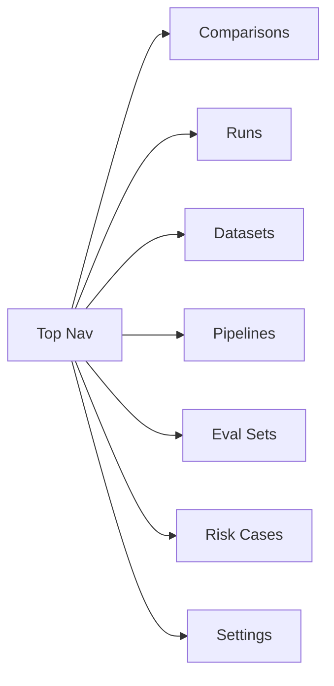
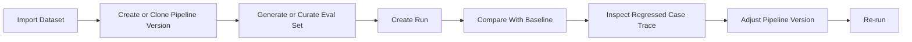
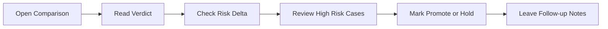

# RAG Lab V1 Wireframes

## Overview

本文件用于补齐 `RAG Lab V1` 的低保真原型图。  
目标不是定视觉风格，而是明确：

- 页面信息架构
- 主操作流
- 工程师视角与业务视角的界面边界
- 首页为什么以 `Comparison` 为中心

当前已经确认的原型原则有三条：

1. 主入口页是 `Comparisons`
2. 首页第一屏采用 `Verdict first`
3. 工程师主操作流是 `Compare -> Trace -> Adjust -> Re-run`

---

## 1. Global Navigation



导航顺序本身就要体现产品中心。

- `Comparisons` 放第一位，因为产品的第一性目标是判断改造值不值得推进
- `Runs` 是支撑页，负责执行过程
- `Datasets / Pipelines / Eval Sets` 是实验材料与实验变量管理页

这里刻意不把“聊天”放进主导航，避免产品重心滑回旧项目的 `/faq/chat` 叙事。

---

## 2. Home = Comparison Center

```text
+----------------------------------------------------------------------------------+
| Comparisons                                                     [Create Run]     |
+----------------------------------------------------------------------------------+
| Tabs: Comparisons | Runs | Datasets | Pipelines | Eval Sets | Risk Cases        |
+----------------------------------------------------------------------------------+
| Verdict Card                                                                      |
| +-------------------------------------------------------------------------------+ |
| | Verdict: beneficial                                                           | |
| | Headline: 本次改造整体有益，非标准问法提升明显，风险项轻微上升但未越阈值。 | |
| | Recommendation: Promote to next round after reviewing 2 high-risk cases.      | |
| +-------------------------------------------------------------------------------+ |
+----------------------------------------------------------------------------------+
| Why This Verdict?                                                                 |
| +----------------------+ +----------------------+ +-----------------------------+ |
| | Pass Rate            | | Answer Correctness   | | Faithfulness               | |
| | 0.78 -> 0.82 (+0.04) | | 0.71 -> 0.77 (+0.06) | | 0.83 -> 0.82 (-0.01)      | |
| +----------------------+ +----------------------+ +-----------------------------+ |
| +----------------------+ +----------------------+ +-----------------------------+ |
| | Context Recall       | | Context Precision    | | Noise Sensitivity          | |
| | 0.69 -> 0.76 (+0.07) | | 0.73 -> 0.70 (-0.03) | | 0.19 -> 0.24 (+0.05)      | |
| +----------------------+ +----------------------+ +-----------------------------+ |
+----------------------------------------------------------------------------------+
| Risk Summary                                                                       |
| - High-risk regressed cases: 2                                                   |
| - Overreach delta: +0.02                                                         |
| - Wrong source delta: +0.00                                                      |
+----------------------------------------------------------------------------------+
| Action Strip                                                                       |
| [Inspect Regressions] [Open Full Report] [Mark Promote/Hold] [Create Follow-up] |
+----------------------------------------------------------------------------------+
```

这个首页不是“总览页”，而是“裁决中心”。

它第一屏的顺序固定为：

1. `Verdict`
2. `Why`
3. `Metric diff summary`
4. `Risk summary`
5. `Action`

也就是：

```text
Verdict -> Evidence Summary -> Risk Summary -> Next Action
```

原因很简单：  
这个产品不是指标浏览器，而是实验结论系统。首页应该先回答最贵的问题：

`这次改造，值不值得继续推进？`

---

## 3. Comparison Detail Page

```text
+----------------------------------------------------------------------------------+
| Comparison: Run #1041 vs Run #1042                              beneficial       |
+----------------------------------------------------------------------------------+
| Dataset: jd-help/v3    Eval Set: smoke-v1                                        |
| Base: baseline-v1      Target: hybrid-rrf-v2                                     |
+----------------------------------------------------------------------------------+
| Verdict Summary                                                                    |
| - beneficial                                                                      |
| - 非标准问法明显提升                                                               |
| - 风险可控，但需复核 2 个 high-risk regression                                     |
+----------------------------------------------------------------------------------+
| Metric Diff                                                                        |
| +---------------------+-----------+-----------+-----------+                      |
| | Metric              | Base      | Target    | Delta     |                      |
| +---------------------+-----------+-----------+-----------+                      |
| | Pass Rate           | 0.78      | 0.82      | +0.04     |                      |
| | Answer Correctness  | 0.71      | 0.77      | +0.06     |                      |
| | Faithfulness        | 0.83      | 0.82      | -0.01     |                      |
| | Context Recall      | 0.69      | 0.76      | +0.07     |                      |
| | Context Precision   | 0.73      | 0.70      | -0.03     |                      |
| | Noise Sensitivity   | 0.19      | 0.24      | +0.05     |                      |
| +---------------------+-----------+-----------+-----------+                      |
+----------------------------------------------------------------------------------+
| Bucket Diff                                                                        |
| standard_query +3% | paraphrase_query +8% | typo_query +5%                       |
| out_of_scope overreach +2% | no_answer stable                                     |
+----------------------------------------------------------------------------------+
| Case Buckets                                                                       |
| +---------------------+ +----------------------+ +-------------------------------+ |
| | Improved Cases      | | Regressed Cases      | | High Risk Regressed          | |
| | case_003            | | case_018             | | case_041                     | |
| | case_012            | | case_027             | | case_052                     | |
| +---------------------+ +----------------------+ +-------------------------------+ |
+----------------------------------------------------------------------------------+
| Footer Actions                                                                     |
| [Inspect Regressed Trace] [Promote] [Hold] [Create Follow-up Note]              |
+----------------------------------------------------------------------------------+
```

这个页面是首页的放大版。  
首页负责快速判断，详情页负责给出足够证据。

---

## 4. Engineer Flow



这条流比旧版本多了两个关键变化：

1. `Compare With Baseline` 提前到了 `Run` 之后的第一判断节点  
   原因：单次 run 的指标只能说明“这次长什么样”，真正的决策动作来自“和 baseline 有什么差别”。

2. `Adjust Pipeline Version -> Re-run` 变成显式闭环  
   原因：实验台不是一次性看报告，而是要支持持续迭代。

也就是工程师的真实工作不是：

```text
配置 -> 运行 -> 看结果
```

而是：

```text
配置 -> 运行 -> 分析退化 -> 修正策略 -> 再次运行
```

---

## 5. Business / QA Flow



这里最后一步必须是 `Leave Follow-up Notes`。  
如果业务方只有“看完然后决定”，没有记录“为什么 promote / 为什么 hold / 还要补什么 case”，下一轮回来时上下文会断。

---

## 6. Runs Page

```text
+----------------------------------------------------------------------------------+
| Runs                                                            [Create Run]     |
+----------------------------------------------------------------------------------+
| Recent Runs                                                                       |
| +--------+------------+---------------+------------+-------------+--------------+ |
| | Run No | Dataset    | Pipeline      | Eval Set   | Status      | Actions      | |
| +--------+------------+---------------+------------+-------------+--------------+ |
| | 1042   | jd-help-v3 | hybrid-rrf-v2 | smoke-v1   | succeeded   | Compare      | |
| | 1041   | jd-help-v3 | baseline-v1   | smoke-v1   | succeeded   | View         | |
| | 1043   | jd-help-v3 | hybrid-rrf-v3 | smoke-v1   | running     | Monitor      | |
| +--------+------------+---------------+------------+-------------+--------------+ |
+----------------------------------------------------------------------------------+
| Status Timeline                                                                   |
| draft -> queued -> running -> scoring -> comparing -> succeeded                  |
+----------------------------------------------------------------------------------+
```

`Runs` 现在是支撑页，不是主入口。  
它的职责是：

- 发起实验
- 观察执行状态
- 跳转到 comparison 或 run detail

不再承担“产品首页”的职责。

---

## 7. Run Detail Page

```text
+----------------------------------------------------------------------------------+
| Run #1042                                                        succeeded       |
+----------------------------------------------------------------------------------+
| Dataset: jd-help/v3   Pipeline: hybrid-rrf-v2   Eval Set: smoke-v1              |
| Started: 10:31        Finished: 10:36                                              |
+----------------------------------------------------------------------------------+
| Metrics Snapshot                                                                   |
| +--------------------+ +--------------------+ +--------------------+            |
| | Pass Rate          | | Answer Correctness | | Faithfulness       |            |
| | 82%                | | 0.77               | | 0.82               |            |
| +--------------------+ +--------------------+ +--------------------+            |
| +--------------------+ +--------------------+ +--------------------+            |
| | Context Recall     | | Context Precision  | | Noise Sensitivity  |            |
| | 0.76               | | 0.70               | | 0.24               |            |
| +--------------------+ +--------------------+ +--------------------+            |
+----------------------------------------------------------------------------------+
| Cases Table                                                                        |
| Query | Verdict | Correctness | Risk Flags | Trace                               |
+----------------------------------------------------------------------------------+
| Footer Actions: [Compare With Baseline] [Inspect Trace]                          |
+----------------------------------------------------------------------------------+
```

这个页面的定位是：

- “这一次运行长什么样”
- 不是“这次改造值不值得推进”

因此它要给 `Compare With Baseline` 一个明显动作按钮，把用户带回产品主轴。

---

## 8. Dataset Page

```text
+----------------------------------------------------------------------------------+
| Datasets                                                        [Import Dataset] |
+----------------------------------------------------------------------------------+
| Left: Dataset List                     | Right: Dataset Detail                    |
| +----------------------------------+   +--------------------------------------+   |
| | jd-help                          |   | Name: jd-help                        |   |
| | policy-center                    |   | Type: FAQ + docs                     |   |
| | refund-rules                     |   | Description: ...                     |   |
| +----------------------------------+   +--------------------------------------+   |
|                                       | Versions                              |   |
|                                       | +------+---------+-------+----------+ |   |
|                                       | | Ver  | Docs    |Chunks | Status   | |   |
|                                       | +------+---------+-------+----------+ |   |
|                                       | | v3   | 853     | 2410  | ready    | |   |
|                                       | | v2   | 853     | 1980  | archived | |   |
|                                       | +------+---------+-------+----------+ |   |
|                                       | [View Source Summary] [Build Index]   |   |
+----------------------------------------------------------------------------------+
```

这里最重要的是把 `Dataset` 和 `Dataset Version` 分开显示。  
产品上，数据资产和某次导入快照不是同一个对象；工程上，这保证实验可回放、可比较。

---

## 9. Pipeline Page

```text
+----------------------------------------------------------------------------------+
| Pipelines                                                      [New Pipeline]    |
+----------------------------------------------------------------------------------+
| Pipeline: hybrid-rrf                                                           |
| Version: v2                                                                    |
+----------------------------------------------------------------------------------+
| Config Sections                                                                  |
| +--------------------+ +--------------------+ +-------------------------------+ |
| | Chunking           | | Retrieval          | | Recall Fusion                 | |
| | strategy           | | dense_enabled      | | fusion_strategy = rrf         | |
| | chunk_size         | | sparse_enabled     | | dense_weight                  | |
| | chunk_overlap      | | keyword_enabled    | | sparse_weight                 | |
| +--------------------+ +--------------------+ +-------------------------------+ |
| +--------------------+ +--------------------+ +-------------------------------+ |
| | Rerank             | | Prompt             | | Fallback / Guardrail          | |
| | rerank_model       | | system_prompt      | | medium_confidence_threshold   | |
| | rerank_top_k       | | citation_required  | | require_valid_source          | |
| | doc_type_boosts    | | answer_style       | | source_domain_whitelist       | |
| +--------------------+ +--------------------+ +-------------------------------+ |
+----------------------------------------------------------------------------------+
| Footer Actions: [Save Draft] [Freeze Version] [Create Run]                      |
+----------------------------------------------------------------------------------+
```

这里更准确的动作应该是 `Create Run`，不是旧版本里的 `Run With This Version`。  
原因是实验运行不是只由 pipeline 决定，还需要和 dataset version、eval set 组合起来。

---

## 10. Eval Set Page

```text
+----------------------------------------------------------------------------------+
| Eval Sets                                                     [Generate Cases]   |
+----------------------------------------------------------------------------------+
| Set: smoke-v1                                                                    |
| Dataset: jd-help                                                                 |
+----------------------------------------------------------------------------------+
| Filters: [Label] [Difficulty] [Source Type] [Enabled]                            |
+----------------------------------------------------------------------------------+
| +----------+----------------------+-------------------+-----------+------------+ |
| | Case No   | Query                | Labels            | Difficulty| Enabled    | |
| +----------+----------------------+-------------------+-----------+------------+ |
| | 001      | 忘记密码怎么办？      | standard_query    | easy      | yes        | |
| | 002      | 订单到哪了？          | out_of_scope      | medium    | yes        | |
| | 003      | 密码丢了咋办          | paraphrase_query  | medium    | yes        | |
| +----------+----------------------+-------------------+-----------+------------+ |
+----------------------------------------------------------------------------------+
| Right Drawer: Case Detail                                                        |
| - query                                                                          |
| - expected_answer                                                                |
| - expected_sources                                                               |
| - expected_behavior                                                              |
| - scoring_profile                                                                |
+----------------------------------------------------------------------------------+
```

`Eval Case` 必须被看作“可判卷样本”，不是单纯的问题列表。  
所以右侧详情必须显式展示 `expected_behavior` 和 `scoring_profile`。

---

## 11. Create Run Modal

```text
+---------------------------------------------------------------+
| Create Experiment Run                                         |
+---------------------------------------------------------------+
| Dataset Version      [ jd-help / v3                     v ]   |
| Pipeline Version     [ hybrid-rrf / v2                 v ]   |
| Eval Set             [ smoke-v1                         v ]   |
| Baseline Run         [ run-1041 (optional)             v ]   |
| Notes                [_______________________________     ]   |
+---------------------------------------------------------------+
| [Cancel]                                      [Create Run]    |
+---------------------------------------------------------------+
```

这个弹窗必须短。  
复杂配置应在各自页面里完成，这里只做“选择已准备好的实验材料并发起 run”。

---

## 12. Case Trace Page

```text
+----------------------------------------------------------------------------------+
| Case Trace: case_041                                                             |
+----------------------------------------------------------------------------------+
| Query: 订单到哪了？                                                               |
| Expected Behavior: should_refuse                                                 |
| Final Verdict: FAIL / overreach                                                  |
+----------------------------------------------------------------------------------+
| Step 1: Query Processing                                                         |
| - normalized_query: 订单到哪了                                                   |
| - rewritten_query: 订单物流状态查询                                              |
+----------------------------------------------------------------------------------+
| Step 2: Retrieval                                                                |
| - dense candidates                                                               |
| - sparse candidates                                                              |
| - keyword candidates                                                             |
+----------------------------------------------------------------------------------+
| Step 3: Fusion                                                                   |
| - top merged candidates                                                          |
+----------------------------------------------------------------------------------+
| Step 4: Rerank                                                                   |
| - rerank scores                                                                  |
+----------------------------------------------------------------------------------+
| Step 5: Generation                                                               |
| - context used                                                                   |
| - answer                                                                         |
+----------------------------------------------------------------------------------+
| Step 6: Judgement                                                                |
| - answer_correctness                                                             |
| - faithfulness                                                                   |
| - overreach_flag = true                                                          |
+----------------------------------------------------------------------------------+
| Footer Actions: [Back to Comparison] [Adjust Pipeline] [Re-run]                 |
+----------------------------------------------------------------------------------+
```

这页像“单题事故复盘”。  
最关键的是底部动作必须回到工程师主闭环：

`Trace -> Adjust Pipeline -> Re-run`

---

## 13. Business Decision Strip

```text
+----------------------------------------------------------------------------------+
| Decision Panel                                                                   |
+----------------------------------------------------------------------------------+
| Verdict: beneficial                                                              |
| Action: [Promote] [Hold]                                                         |
| Follow-up Notes: [___________________________________________________________]  |
| Required Next Step: [Review 2 high-risk regressions before promotion        ]    |
+----------------------------------------------------------------------------------+
```

业务/测试流最后必须有“记录决策”的界面元素。  
否则就会变成“看完了、决定了、但下次没人知道为什么这么决定”。

---

## 14. Prototype Notes

这套原型是低保真线框，不是视觉定稿。  
它解决的不是颜色、动效和视觉风格，而是更基础的 4 个问题：

1. 产品中心是不是 `Comparison`
2. 首页是不是 `Verdict first`
3. 工程师流是不是显式闭环
4. 业务决策是否有记录落点

如需后续补充，可以分成两步：

- 高保真视觉稿：定视觉风格
- 可点击交互原型：验证 `Comparison -> Trace -> Adjust -> Re-run` 是否顺手
