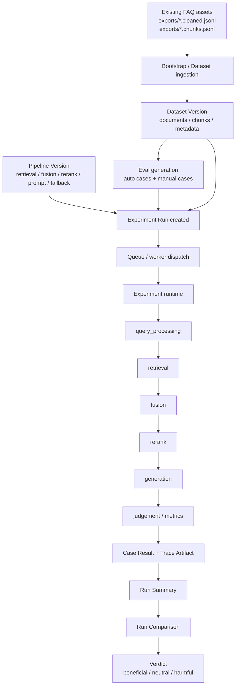

# RAG Lab Execution Flow

## 1. Why This Flow Exists

RAG Lab 的核心问题不是“某个问题能不能答”，而是“某次改造值不值得继续推进”。因此它的执行流天然不是单条问答链，而是一条带版本、带回放、带比较的实验闭环：

```text
Dataset -> Pipeline -> Eval Set -> Experiment Run -> Comparison Verdict
```

如果把它和传统 `/faq/chat` 做对比：

- `/faq/chat` 是在线推理流，输入一条 query，输出一条 answer。
- `RAG Lab` 是离线实验流，输入一组版本化对象，输出一份可审计 verdict。

前者像一次门诊，后者像一次临床试验。

## 2. End-to-End Flow



## 3. Step-by-Step Semantics

### 3.1 Dataset ingestion

输入通常来自既有 FAQ 资产：

- `*.cleaned.jsonl` 近似“文档级真相”
- `*.chunks.jsonl` 近似“检索级切片”

这里要区分两个相近但不同的概念：

- `Dataset` 是集合定义，像一本书的书名。
- `Dataset Version` 是某次导入快照，像这本书的某一版印刷。

只有 `Dataset Version` 才能进入实验，因为实验要求可复跑、可比较、可追溯。

### 3.2 Pipeline freezing

`Pipeline` 描述一类实验策略，`Pipeline Version` 描述一次冻结后的具体配置。

这里的“冻结”很重要。它的反概念是“读取当前最新配置”。后者对线上服务也许方便，但对实验是危险的，因为一旦配置漂移，实验就无法回放。于是：

$$
\text{Run} = f(\text{dataset version}, \text{pipeline version}, \text{eval set})
$$

这个函数式视角的含义是：同样输入应该尽量得到同样的实验语义，不能偷偷依赖“当前环境恰好是什么”。

### 3.3 Eval Set generation

`Eval Set` 是一组题目，`Eval Case` 是其中一题。每个 case 至少表达四件事：

1. 用户问了什么：`query`
2. 理想答案是什么：`expected_answer`
3. 理想来源是什么：`expected_sources`
4. 理想行为是什么：`should_answer / should_fallback / should_refuse`

很多团队会把评测近似成“文本像不像”。这在 RAG 场景里不够，因为正确的 fallback 往往比貌似流畅的乱答更重要。换句话说：

$$
\text{case success} \neq \text{answer similarity only}
$$

它还依赖行为正确性、来源合法性和越界风险。

### 3.4 Run execution

Run 创建后，控制面只负责登记与调度，不负责在 HTTP 请求里把整批 case 全跑完。真正执行发生在 worker / runtime 侧。

状态机主路径是：

```text
draft -> queued -> running -> scoring -> succeeded
```

其中：

- `draft` 表示对象已创建但尚未投递。
- `queued` 表示等待后台执行。
- `running` 表示逐 case 跑实验。
- `scoring` 表示聚合指标与判分。
- `succeeded` 表示实验完成，不代表“结果一定更好”。

这又引出一个常见混淆：

- `run failed` 是系统没跑完。
- `run harmful` 是系统跑完了，但对比后发现改造有害。

二者不是一回事。前者是执行失败，后者是实验结论。

### 3.5 Runtime trace

当前标准 trace 分段是：

- `input`
- `query_processing`
- `retrieval`
- `fusion`
- `rerank`
- `generation`
- `judgement`
- `verdict`

这组分段的价值在于，它把“系统答错了”进一步拆成“究竟错在召回、融合、重排、生成，还是评分规则”。这和医学里的“诊断分层”类似，不只是看到症状，而是定位病灶。

### 3.6 Comparison and verdict

单次 run 只能说明“这版系统表现如何”；只有 comparison 才能回答“这次改造是否值得推进”。

对比产物至少包括：

- 总体指标 diff
- bucket analysis
- improved cases
- regressed cases
- high risk regressed cases
- recommendation

最终 verdict 不是简单平均分，而是一个关于质量变化、安全变化与风险变化的决策函数：

$$
\text{verdict} = g(\Delta \text{quality}, \Delta \text{safety}, \Delta \text{risk})
$$

因此，哪怕平均正确率略升，只要高风险退化显著增加，结论也可能是 `harmful`。

## 4. Storage Split

RAG Lab 刻意把数据拆成两层存储：

- MySQL 保存核心元数据、关系、状态、聚合摘要。
- Artifact storage 保存完整 trace、原始报告等重对象。

这种拆分可以类比为：

- MySQL 像图书馆目录卡，回答“有什么、彼此什么关系、现在什么状态”。
- Artifact storage 像档案馆原件，回答“那次实验的完整证据到底长什么样”。

## 5. Smoke-Test Expectations

最小活体冒烟应覆盖两类信号：

1. 进程是否能启动，例如 `GET /health`
2. 控制面路由是否真的暴露，例如 `GET /rag-lab/datasets`

这两者不是同义词。`/health` 正常只能说明应用主进程活着，不能推出 RAG Lab 控制面一定可用。Task 15 的一次实际冒烟就暴露了这个差异：`/health` 返回 `200`，但 `GET /rag-lab/datasets` 仍返回 `404`。这意味着后续验证不能只看健康检查，还必须看控制面路由的 live HTTP 表现。

## 6. Practical Reading Order

如果要快速理解当前系统，建议顺序是：

1. 先看 [RAG_LAB_V1_SPEC.md](/D:/IdeaProjects/canbe_agents/docs/RAG_LAB_V1_SPEC.md)，理解对象模型和 verdict 目标。
2. 再看本文，理解这些对象如何串成执行流。
3. 最后结合 README 中的启动、迁移与测试命令，做本地验证。
